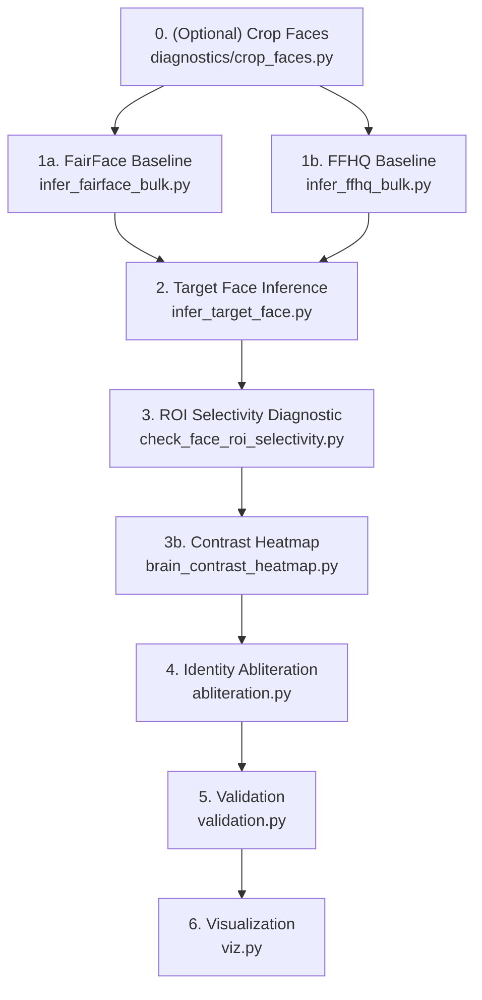
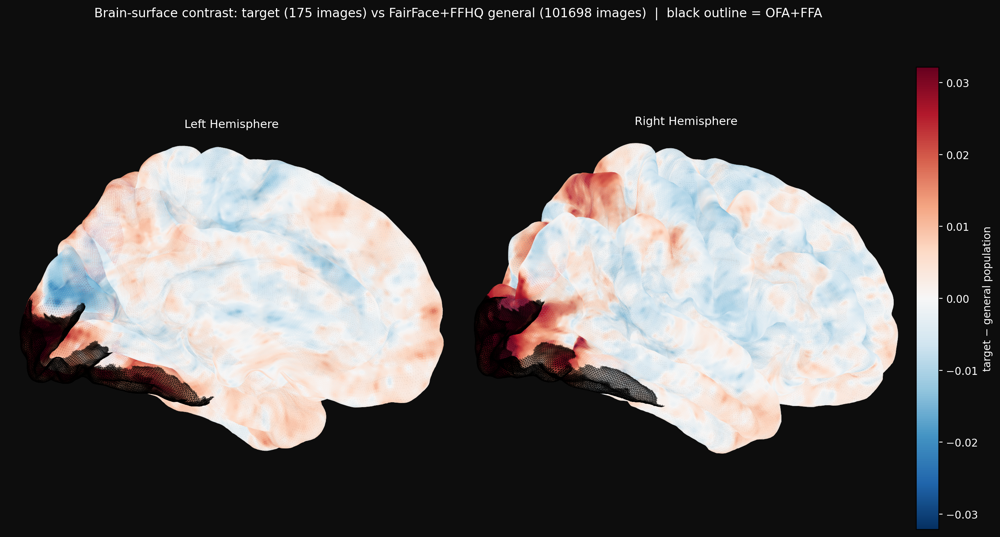

# TRIBE v2 Face Identity Abliteration Pipeline

A fully data-driven pipeline for surgeon-like **face identity suppression** inside the TRIBE v2 brain model. Same model and abliteration goal as [janice-stfu](https://github.com/aloshdenny/janice-stfu), retargeted from video concept categories to a **specific person's face**, with a 101,698-image FairFace + FFHQ general-population baseline, face-selective cortical ROI masks (OFA/FFA), multi-layer PCA weight surgery, and automated artifact chunking for GitHub.

---

## 🚀 Setup & Installation

Follow these steps to set up the project locally using your existing `tribev2` Conda environment:

```bash
# 1. Clone the repository
git clone https://github.com/aloshdenny/e85.git
cd e85

# 2. Activate your tribev2 conda environment
conda activate tribev2

# 3. Install required dependencies
pip install -r requirements.txt
```

---

## 📂 Data Layout

The pipeline uses two data sources: a **general-population baseline** (FairFace + FFHQ, merged) and a **target person** whose face identity is to be abliterated.

The baseline used to be 126 demographic buckets of FairFace. It is now one flat, merged, per-image set: **97,698 FairFace** images followed by **4,000 FFHQ** images, **101,698 total**, with a strict 1:1 mapping between each image in the zip and its prediction npz.

```
fairface + ffhq/                  # merged general-population images
  ├── fairface + ffhq_chunk_000.zip   # byte chunks of the 1.0GB zip
  ├── ...                             # fuse with chunk_utils to rebuild
  └── fairface + ffhq_chunk_010.zip
      # fused contents: 1.jpg .. 97698.jpg   (FairFace)
      #                 97699.png .. 101698.png (FFHQ)

fairface + ffhq preds/            # one npz per image, stem matches the image
  ├── 1.npz                       # 'preds' (20484,) + 'filename'
  ├── ...
  └── 101698.npz

target/                 # target person raw images (one or more *.zip)
  └── **.zip            # discovered recursively (e.g. mia.zip)

target_preds/           # npz predictions from infer_target_face.py
  └── **.npz            # discovered recursively (e.g. mia.npz)

val/                    # holdout images for validation (target + general faces)
  ├── mia1_face.jpg
  ├── euro1_face.jpg
  └── ...

brain_contrast/         # outputs of brain_contrast_heatmap.py
  ├── ofa_ffa.png
  ├── all_visual.png
  └── entire_brain.png

abliterated/            # outputs of abliteration.py
  ├── vjepa2_hf_checkpoint/   # HF-format sharded safetensors for validation redirect
  ├── directions_L{idx}.npy
  ├── surgery_log.json
  ├── raw_activations_norm/
  └── masks/
      ├── face_mask.npy
      └── layer_profile.npy
```

> **Target Specification**: All `*.zip` under `./target/` and all `*.npz` under `./target_preds/` are discovered recursively.

> **Not in the repo**: the unmerged sources (`fairface/`, `fairface_preds/`, `ffhq/`, `ffhq_preds/`) are gitignored. They are fully contained in the merged set above, and shipping both would double an already large repo. Regenerate them with the two bulk inference scripts if you need the split view.

Rebuild the merged image zip from its chunks:
```python
from scripts.chunk_utils import fuse_chunks_to_file
fuse_chunks_to_file("fairface + ffhq/fairface + ffhq.zip",
                    "fairface + ffhq/fairface + ffhq.zip")
```

---

## ⚙️ Abliteration Pipeline

The dependency chain, with the two baselines running independently:



### 0. (Optional) Crop Faces
Detects the highest-confidence face per image with MTCNN and crops in place under `./target/` (configurable `SRC_DIR` in the script).
```bash
python scripts/diagnostics/crop_faces.py
```
Zip cropped faces under `./target/` before running target inference.

### 1a. FairFace Baseline Inference
Bulk TribeV2 inference over all FairFace category zips in `./fairface/`. Batched for GPU throughput. Writes per-category `.npz` (auto-chunked if over GitHub’s 100MB limit) to `./fairface_preds/`.
```bash
python scripts/infer_fairface_bulk.py
```

### 1b. FFHQ Baseline Inference
Same idea, different shape of input. FFHQ has no demographic buckets, it’s one flat folder of images, so this writes **one npz per image** (`{stem}.npz` holding that image’s mean prediction vector) and resumes by skip-if-exists rather than shard bookkeeping. `--duration` defaults to **3.0s**, the TRIBE v2 paper’s validated setting for the still-image-as-video case, not the 1.0s empirical floor.
```bash
python scripts/infer_ffhq_bulk.py --images-dir ./ffhq --out-dir ./ffhq_preds --batch-size 64
```
Both baselines are then merged into the flat `fairface + ffhq` set described above.

### 2. Target Face Inference
TribeV2 inference over all target zips found recursively in `./target/`. Outputs to `./target_preds/`.
```bash
python scripts/infer_target_face.py
```

### 3. ROI Selectivity Diagnostic
Checks whether the target-vs-general contrast is concentrated in face-selective ROIs (OFA, FFA, STS, ATL, TP, …) or diffuse across cortex. Defaults to the merged FairFace+FFHQ per-image preds. Run before surgery to confirm a clean, face-localised signal.
```bash
python scripts/diagnostics/check_face_roi_selectivity.py
# or explicitly:
python scripts/diagnostics/check_face_roi_selectivity.py \
  --general-dir "./fairface + ffhq preds" --target-npz ./target_preds
```

### 3b. Brain Contrast Heatmap
The same question as the selectivity table, but as a picture. Renders the **full signed contrast** (`target_mean − general_mean`) across all 20,484 vertices on the fsaverage pial surface, diverging RdBu_r centered at zero, so you can see whether the strongest contrast lands inside face-selective cortex or spills outside it. No new inference, it reuses the existing npz predictions.

Three outline modes, each writing its own file into `--out-dir` (default `./brain_contrast`). The outline is purely visual, the underlying contrast is identical across all three.

| Command | Outline | Output |
|---------|---------|--------|
| `python scripts/brain_contrast_heatmap.py` | OFA + FFA | `ofa_ffa.png` |
| `python scripts/brain_contrast_heatmap.py --include-secondary` | full face circuit (STS, ATL, TP, PREC, MPFC, PCC) | `all_visual.png` |
| `python scripts/brain_contrast_heatmap.py --entire` | none, whole cortex | `entire_brain.png` |



It also drops the raw signed contrast vector (native fsaverage5, shape `(20484,)`) at `brain_contrast/contrast_native_fsaverage5.npy`, and prints mean `|contrast|` inside vs outside the outlined circuit so you get the number alongside the picture.

### 4. Identity Abliteration (Surgery)
Builds a cortical face mask (OFA+FFA by default; add `--include-secondary` for TP+ATL), collects per-layer vjepa2 activations from static repeated frames, computes PCA directions, applies surgical weight suppression, and exports an HF-format checkpoint for validation.
```bash
python scripts/abliteration.py \
  --general-preds-dir ./fairface_preds --general-zips-dir ./fairface \
  --target-preds-npz ./target_preds/mia.npz --target-zip ./target/mia.zip \
  --tolerance -1.0 --n_components 3 --n_layers 5

# Include secondary face ROIs (TP + ATL)
python scripts/abliteration.py \
  --general-preds-dir ./fairface_preds --general-zips-dir ./fairface \
  --target-preds-npz ./target_preds/mia.npz --target-zip ./target/mia.zip \
  --tolerance -1.0 --n_components 3 --n_layers 5 --include-secondary
```

> **Layout caveat**: `abliteration.py` still expects the old per-bucket layout, a folder of category npz each holding `preds` (N, 20484) + `filenames` (N,) alongside a same-stem zip. It has not been ported to the flat merged per-image set yet, so regenerate `./fairface/` and `./fairface_preds/` (step 1a) before running surgery.

### 5. Validation
Redirects TribeV2’s image extractor to the local HF checkpoint, clears cache pitfalls with distinct pass-2 events, and compares mask-averaged brain response before vs. after surgery on `./val/` holdouts (target prefix vs. general faces).
```bash
python scripts/validation.py --val-dir ./val --target-prefix mia \
  --hf-checkpoint-dir ./abliterated/vjepa2_hf_checkpoint
```

### 6. Visualization
Interactive brain-scan HTML (`interactive_study/combined_interactive.html`) with FairFace slider and target-vs-baseline toggle, plus per-category PNG maps under `fairface_study/` / `target_study/`.
```bash
python scripts/viz.py
```

---

## 💾 Checkpoint & NPZ Chunking

GitHub enforces a **100MB per-file** limit and a **~2GB pack size** per push.

### Prediction NPZs
Oversized `.npz` files are automatically split on save into byte chunks (`{stem}_chunk_000.npz`, …) via `scripts/chunk_utils.py`. Consumers (`viz.py`, `abliteration.py`, diagnostics) call `load_npz()` / `discover_npz()`, which re-fuse chunks to a temp file, load, and delete the temp. The merged per-image preds are ~80KB each so none of them chunk in practice.

### Merged image zip
The fused `fairface + ffhq.zip` is 1.0GB, well over the file limit, so it ships as 11 byte chunks (`fairface + ffhq_chunk_000.zip` … `_010.zip`) using the same pattern. `fuse_chunks_to_file()` rebuilds it. The fused zip itself is gitignored.

### Abliterated HF checkpoint
Surgery exports `abliterated/vjepa2_hf_checkpoint/` as sharded `.safetensors` (default `--max-shard-size 20MB`) so individual shards stay under the file limit. Push large trees in separate size-capped commits (subfolder-isolated batches under ~1.5 GiB) to stay under the pack limit.

### Legacy `.pt` chunk helpers
`chunk_utils.save_chunked` / `load_chunked` still support `<25MB` binary splits of PyTorch state dicts (same pattern as janice-stfu) when needed.

---

## 🧠 Methodology & Concepts

### 1. Cortical Face ROIs (Destrieux Atlas)
Surgery targets vertices in **OFA** and **FFA** — the primary face-selective regions with clean target-vs-general contrast. Secondary ROIs (TP, ATL) are optional via `--include-secondary`.

| ROI | Label(s) | Role |
|-----|----------|------|
| **OFA** | `G_and_S_occipital_inf`, `S_oc_middle_and_Lunatus`, `Pole_occipital` | Early face detection |
| **FFA** | `G_oc-temp_lat-fusifor` | Face identity recognition |
| **TP** *(secondary)* | `Pole_temporal` | Person familiarity / semantic memory |
| **ATL** *(secondary)* | `G_temporal_inf`, `G_oc-temp_med-Parahip` | Person identity (broader) |

> **Note**: Subcortical reward nodes (nucleus accumbens, amygdala, hippocampus) and high-ranking photometric confounds (e.g. V4/MT on static images) are not used as ablation targets.

### 2. General-Population Contrast
Instead of janice-stfu’s video-category LOSO, the identity contrast is against a broad face baseline:
- **contrast** = `target_mean − general_mean`, where `general_mean` is the streaming per-image mean over all 101,698 FairFace + FFHQ predictions.

FairFace supplies balanced coverage across age × gender × race, FFHQ supplies in-the-wild variation that FairFace’s tight crops don’t. Averaging per image rather than per bucket keeps the estimate simple now that every image has its own npz. The older per-bucket layout weighted each demographic bucket equally so large groups couldn’t dominate, which `abliteration.py` still does internally.

### 3. PCA Direction-Finding (Weighted)
Activations are collected for target and sampled general images at each selected encoder layer (static frame repeated to vjepa2’s clip length — no fake mp4 path). PCA directions use the **y-weighted covariance** of centered activations, where `y = preds[:, mask].mean()` (mask-averaged brain response from the precomputed npzs). Directions track the face-identity brain signal rather than arbitrary activation variance.

### 4. Multi-Layer Surgery
`--n_layers N` selects the top-N encoder layers ranked by correlation between per-layer L2-norm and `y`. Directions and surgery are per-layer:
- Directions: `abliterated/directions_L{layer_idx}.npy`
- Surgery log: `abliterated/surgery_log.json`
- Deployable weights: `abliterated/vjepa2_hf_checkpoint/`

### 5. Tolerance Scale
Continuous scale mapping surgeon intervention outcomes (same as janice-stfu):
```
  -1       -0.5       0       +0.5       +1
   |--------|---------|---------|--------|
   Repulsion Aversion  Neutral  Acceptance Attraction
```
- **Tolerance < 0**: Suppress / repel the concept (face identity).
- **Tolerance = 0**: Neutral (no effect).
- **Tolerance > 0**: Accept / tolerate the concept.
> **Note**: Positive tolerance represents the absence of aversion (no pushback), not a preference for the concept.

---

## 🛠️ Troubleshooting

### Deadlock on Cache Access
If multi-process file locks deadlock, remove the inflight database in your cache directory:
```bash
find ./cache -name "inflight.db" -delete
```

### No Zip / NPZ Files Found
Place target archives under `./target/` (`.zip`) and predictions under `./target_preds/` (`.npz`). Discovery is recursive. For chunked FairFace preds, keep the full `{stem}_chunk_NNN.npz` set — `load_npz(stem.npz)` recombines them automatically.

### Validation Shows Zero “Encoding video” Bars on Pass 2
Pass 2 must use distinct event filepaths **and** timeline IDs (the validation script hardlinks clips for this). Identical events hit the neuralset cache regardless of the abliterated weights.
